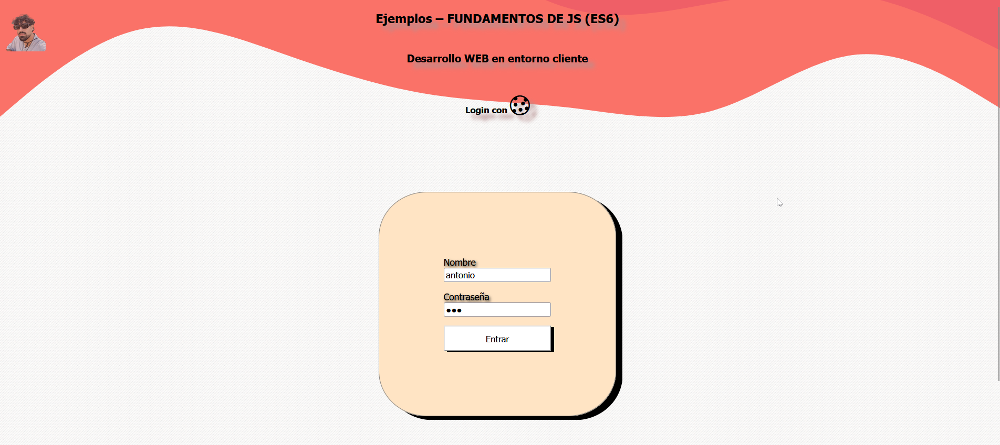

<p align="center">
  <a href="" rel="noopener">
 </a>
</p>

<h3 align="center">Formulario con Cookies & Numbers</h3>

<div align="center">

[]()
[](https://www.reddit.com/user/Wordbook_Bot)
[](https://github.com/kylelobo/The-Documentation-Compendium/issues)
[](https://github.com/kylelobo/The-Documentation-Compendium/pulls)
[](/LICENSE)

</div>

---
<div align="center">

🤖 Proyecto para la asignatura desarrollo en el entorno de cliente en el Instituto [Alang Turing]((https://img.shields.io/badge/license-MIT-blue.svg)).

</div>

<br> 

## 📝 Table of Contents

- [About](#about)
- [Demo / Working](#demo)
- [How it works](#working)
- [Usage](#usage)
- [Scafolding](#scafolding)
- [Coding login](#codingLogin)
- [Coding miniCalc](#miniCalc)
- [Coding conversor](#conversor)
- [Authors](#authors)
- [References](#references)

## 🧐 About <a name = "about"></a>

Poyecto de clase centrado en acceder mediante un formulario login creando un **cookie** y poder navegar por la página hasta que nos deslogueemos o se acabe el tiempo estipulado.

## 🎥 Demo / Working <a name = "demo"></a>

<div align="center">


</div>


## 💭 How it works <a name = "working"></a>

Abrimos el documento, veremos como el login ya tiene las credenciales para que se ahorre tiempo a escribir, si el login no es correcto, no nos debería dejar entrar.

Una vez dentro nos aparecerá una barra de navegacion superior que nos agregará funcionalidades nuevas, como la de movernos a través de la web y hacer el temido logout.

Además aparecerá un apartado nuevo cada semana, en este caso es Numbers, donde hay dos ejercicios uno es una minicalculadora y otro es un convertidor de bases de decimal a otras.

## 🎈 Usage <a name = "usage"></a>

Para usarlo:

```
git clone https://github.com/toniipower/JavascriptES6.git
```

Se descargarán todos los proyectos que tengo hasta el momento.
En este caso debes abrir la carpeta **4. LoginConCookies**

Credenciales por si se olvidan (aunque no creo 😜)

```bash
# Usuario
antonio
# Contrasña
123
```

## 🌳  scafolding <a name = "scafolding"></a>
<div align="center">
Representación de mi estructura de carpetas recreada por chatGPT.

</a>

</div>

.
├── assets/
├── css/
├── cursor/
├── ejercicios/
│   ├── ejer01/
│   │   ├── js/
│   │   │   └── scriptCalc.js
│   │   └── index.html
│   ├── ejer02/
│   │   ├── js/
│   │   │   └── scriptConversor.js
│   │   ├── index.html
│   │   └── main.html
│   └── img/
├── js/
│   ├── captures.js
│   ├── cookies.js
│   ├── deleteCookie.js
│   ├── existeLaCookie.js
│   ├── getCookie.js
│   ├── login.js
│   ├── logout.js
│   └── validate.js
├── index.html
└── README.md


## ⌨️  coding login <a name = "codingLogin"></a>

**capures.js**
```js
/* ARCHIVO DE JS DONDE TENGO CAPTURAS PRINCIPALES USADAS EN VARIOS ARCHIVOS PARA NO TENER QUE CAPTURAR EN CADA ARCHIVO */

/* ELEMENTOS DEL DOM RELACIONADOS CON FORMULARIO */
const formButton = document.getElementById("formButton");
const formContainerId = document.getElementById("formContainerId");
const userForm = document.getElementById("userForm");
const passForm = document.getElementById("passForm");
let pass = passForm.value;
let usuario = userForm.value;

/* ELEMENTOS DEL DOM RELACIONADOS CON LA BARRA DE NAVEGACIÓN */
const menuNav = document.getElementById("menuNav");
const logoutButton = document.getElementById("logout");

/* VARIABLES DE CREDENCIALES */
const NOMBRE_USUARIO = "antonio";
const PASS_USUARIO = "123";
```

**login.js**
```js
formButton.addEventListener("click", login);
/* Comprobación para ver si existe la cookie con el token dado */
if (getCookie("LoggIn")) {
    // Si la cookie existe, nos lleva al main
    window.location.href = "ejercicios/main.html";
}

/* Función que hace que puedas entrar o no!
Si `validate()` es true, llamamos a `thereMyCookies` para crear la cookie */
function login() {

    // Llamamos a la función de validación
    if (validate(usuario, pass, NOMBRE_USUARIO, PASS_USUARIO, usuario.length)) {
        thereMyCookies("LoggIn", "true");
        window.location.href = "ejercicios/main.html";
    } else {
        console.log("Credenciales inválidas, no se crea la cookie.");
    }

    return usuario = userForm.value
}
```
**getCookie.js**
```js
/* Función que captura las cookies y me quedo con el name o nombre */
function getCookie(name) {

    let cookies = document.cookie.split(";");

    console.log(cookies);
    for (let cookie of cookies) {
        cookie = cookie.split("="); // me quedo con: [nombre?, valor?]
        console.log(cookie);
        if (decodeURIComponent(cookie[0]) == name) { // comparo nombre? con el que estoy buscando
            return decodeURIComponent(cookie[1]); // me quedo con el valor del nombre que estoy buscando
        }
    }
    
    // return false;
    
}
```
**validate.js**
```js
/* Función de validación, donde se hace una comprobación en el formulario y se hace una comparación con nuestras credenciales guardadas, para ello le paso los argumentos que ha de comprobar */
function validate(nombreUser, passUser, nombreUsuario, passUsuario, userLength) {
    let validateOk = true;

    // Si los campos están vacíos
    if (nombreUser == "" || passUser == "") {
        contenido.innerHTML = "<div class='card marginBot containerCard bgColor'><p class='center'> Debes introducir algo </p><br><br><p class='center'><a href='./index.html'>Reintentar</a></p></div>";
        validateOk = false;

    // Si el nombre de usuario tiene menos de 3 caracteres
    } else if (userLength <= 3) {
        contenido.innerHTML = "<div class='card marginBot containerCard bgColor'><p class='center'> El usuario debe tener más de 3 caracteres! </p><br><br><p class='center'><a href='./index.html'>Reintentar</a></p></div>";
        validateOk = false;

    // Si las credenciales no coinciden
    } else if (nombreUser !== nombreUsuario || passUser !== passUsuario) {
        contenido.innerHTML = "<div class='card marginBot containerCard bgColor'><p class='center'> El usuario o la contraseña no son correctos! </p><br><br><p class='center'><a href='./index.html'>Reintentar</a></p></div>";
        validateOk = false;

    // Si las credenciales coinciden
    } else if (nombreUser === nombreUsuario && passUser === passUsuario) {
        validateOk = true;
    }

    return validateOk;
}

```
**cookies.js**
```js
//Función que setea la cookie, entran por parametros dos valores String que se envían desde login.js y son usados para crear la cookie.
function thereMyCookies(nombre, valor) {
    console.log(`${nombre}  ${valor} <<<<<<<<<<<<<<<<<<<<<<<<<<<`);
    
    let fechaExpiracion = new Date();

    fechaExpiracion.setTime(fechaExpiracion.getTime() + (1 * 60 * 1000)); // 1 minuto = 60 * 1000 milisegundos

    document.cookie =`${encodeURIComponent(nombre)}=${encodeURIComponent(valor)}; expires=${fechaExpiracion.toUTCString()}; path=/; SameSite=Strict; Secure;`;
    console.log(document.cookie); // muestro la creación
}
```
**logout.js**
```js
/* Cuando pulsamos el boton de logout, llamamos a delete y le pasamos el token una vez hecho, redireccionamos */
document.getElementById("logout").addEventListener("click", function() {
    // console.log(usuario);
    alert("Atención, estás saliendo......");
    
    deleteCookie("LoggIn");
    window.location.href = "../index.html";
    
});
```

**deleteCookie.js**
```js
/* Elimino la cookie añadiendo la fecha de expiración hasta la primera fecha posible que se permite poner, para que no pueda haber resquicios */
function deleteCookie(name) {
    console.log(name);
    document.cookie = `${name}=; expires=Thu, 01 Jan 1970 00:00:00 UTC; path=/;SameSite=Strict;Secure`;
}
```

**existeLaCookie.js**
```js
/* Funcion creada de ultima hora para llevarla al main (se implementará en otros sitios en un futuro) */
if (!getCookie("LoggIn")) {
    // Si la cookie existe, mostramos el formulario
    window.location.href = "../index.html";
    // window.location.reload();
}
```

**funciones.js**
```js
/* Funcion de navegación de main.html */
const container = document.querySelector('.desplegableContain');
const items = container.querySelectorAll('.item');
const containerCard = document.querySelector('#containerCardId');
/* Por cada elemento llamado item hago un addeventListener, para que me de su posición y hacer un innerHtml personalizado, asi me ahorro algo de código y tiene un comportamiento parecido a un framework */
items.forEach((item, index) => {
    item.addEventListener('click', () => {
        switch (index) {
            case 0:
                containerCard.innerHTML = 
                `<div class="card">
                <div class="cardTitle">MiniCalc</div>
                <div class="cardBody">
                    <p>Pequeña calculadora para juguetear</p>
                </div>
                <a class="cardFooter" href="ejer01/index.html"> <div > Solución </div> </a>
                <a class="cardFooter" href="./main.html"> <div > Atrás </div> </a>
                </div>`;
                break;
            case 1:
                containerCard.innerHTML = 
                `<div class="card">
                <div class="cardTitle">Conversor</div>
                <div class="cardBody">
                    <p>Conversor de bases:</p>
                    <p>Base 2</p>
                    <p>Base 8</p>
                    <p>Base 16</p>
                </div>
                <a class="cardFooter" href="ejer02/index.html"> <div > Solución </div> </a>
                <a class="cardFooter" href="./main.html"> <div > Atrás </div> </a>
                </div>`;
                break;
            default:
                containerCard.innerHTML = `<div id="mensaje">SELECCIONE UN EJERCICIO DE LA BARRA DE NAVEGACION</div>`;
                break;
        }
    });
});


```

## ⌨️  coding miniCalc <a name = "miniCalc"></a>

**scriptCalc.js**
```js
let input1 = document.getElementById('input1');
let input2 = document.getElementById('input2');
let resultado = document.getElementById('resultado');

/* Suma */
document.getElementById('sumar').addEventListener('click', () => {
  let num1 = parseFloat(input1.value);
  let num2 = parseFloat(input2.value);
  let suma = num1 + num2;
  resultado.innerHTML = `Resultado: ${suma}`;
});

/* Resta */
document.getElementById('restar').addEventListener('click', () => {
  let num1 = parseFloat(input1.value);
  let num2 = parseFloat(input2.value);
  let resta = num1 - num2;
  resultado.innerHTML = `Resultado: ${resta}`;
});

/* División */
document.getElementById('dividir').addEventListener('click', () => {
  let num1 = parseFloat(input1.value);
  let num2 = parseFloat(input2.value);
  if (num2 === 0) {
    resultado.innerHTML = 'No se puede dividir por 0';
  } else {
    let division = num1 / num2;
    resultado.innerHTML = `Resultado: ${division}`;
  }
});

/* Factorial */
document.getElementById('factorial').addEventListener('click', () => {
  let num1 = parseInt(input1.value);
  if (num1 < 0) {
    resultado.innerHTML = 'No hay factorial de numeros negativos';
  } else {
    let factorial = 1;
    for (let i = 1; i <= num1; i++) {
      factorial *= i;
    }
    resultado.innerHTML = `Factorial de ${num1}: ${factorial}`;
  }
});

/* Me quedo con la parte entera */
document.getElementById('entero').addEventListener('click', () => {
  let num1 = parseFloat(input1.value);
  let parteEntera = Math.trunc(num1);
  input1.value = parteEntera;
  resultado.innerHTML = `Parte entera de ${num1}: ${parteEntera}`;
});

/* Me quedo con la parte decimal */
document.getElementById('decimales').addEventListener('click', () => {
  let num1 = parseFloat(input1.value);
  let parteDecimal = num1 - Math.trunc(num1);
  input2.value = parteDecimal; // Limitamos los decimales a 5 cifras
  resultado.innerHTML = `Parte decimal de ${num1}: ${parteDecimal}`;
});

document.getElementById('volver').addEventListener('click', () => {
    window.history.back();
  });
```

## ⌨️  coding conversor <a name = "conversor"></a>
```js
/* CAPTURAMOS EL NUMERO DECIMAL Y EL SELECT. HACEMOS LA TIPICA VALIDACION Y LUEGO USAMOS TOSTRING(BASE) PARA TRANSFORMAR EL NUMERO EN ESA BASE.*/
document.getElementById('convertir').addEventListener('click', () => {
  let numero = parseInt(document.getElementById('numero').value); 
  let base = document.getElementById('base').value;

  if (isNaN(numero)) {
    document.getElementById('resultado').innerHTML = "Por favor, introduce un número válido.";
    return;
  }

  // Convertimos el número a la base seleccionada
  let resultado = numero.toString(base);

  // Mostramos el resultado en el div
  document.getElementById('resultado').innerHTML = `Resultado en base ${base}: ${resultado.toUpperCase()}`;
});

document.getElementById('volver').addEventListener('click', () => {
    window.history.back();
  });
```

## ✍️ Authors <a name = "authors"></a>

- [@toniipower](https://github.com/toniipower/) - Creador

## 🎉 References & helpers <a name = "references"></a>

- [@gifrun](https://gifrun.com/) - Para crear gifs
- [@pandao](https://pandao.github.io/editor.md/en.html) - Open source online markdown editor.
- [@chatGPT](https://chat.openai.com/chat) - Un amigo para todos los desarrolladores.
- [@Jota](https://github.com/jgarmay674/) - Algún código de inspiración
- [@BootStrap](https://icons.getbootstrap.com/) - Iconos de BootStrap.
- [@Online-image-editor](https://www.online-image-editor.com/) - Quitar fondos online.
- [@Haike](https://haikei.app/generators/) - Para diseño con olas(entre otros).


