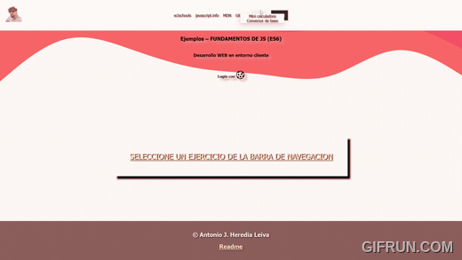

<p align="center">
  <a href="" rel="noopener">
 </a>
</p>

<h3 align="center">Formulario con Cookies & Numbers</h3>

<div align="center">

[]()
[](https://www.reddit.com/user/Wordbook_Bot)
[](https://github.com/kylelobo/The-Documentation-Compendium/issues)
[](https://github.com/kylelobo/The-Documentation-Compendium/pulls)
[](/LICENSE)

</div>

---
<div align="center">

🤖 Proyecto para la asignatura desarrollo en el entorno de cliente en el Instituto [Alang Turing]((https://img.shields.io/badge/license-MIT-blue.svg)).

</div>

<br> 

## 📝 Table of Contents

- [About](#about)
- [Demo / Working](#demo)
- [How it works](#working)
- [Usage](#usage)
- [Scafolding](#scafolding)
- [Coding login](#codingLogin)
- [Coding miniCalc](#miniCalc)
- [Coding conversor](#conversor)
- [Coding Text Modificator](#textModification)
- [Coding API generator](#api)
- [Authors](#authors)
- [References](#references)

## 🧐 About <a name = "about"></a>

Poyecto de clase centrado en acceder mediante un formulario login creando un **LocalStorage** y poder navegar por la página hasta que nos deslogueemos o cerremos el navegador.

## 🎥 Demo / Working <a name = "demo"></a>

<div align="center">



</div>


## 💭 How it works <a name = "working"></a>

Abrimos el documento, veremos como el login ya tiene las credenciales para que se ahorre tiempo a escribir, si el login no es correcto, no nos debería dejar entrar.

Una vez dentro nos aparecerá una barra de navegacion superior que nos agregará funcionalidades nuevas, como la de movernos a través de la web y hacer el temido logout.

Además aparecerá un apartado nuevo cada semana, en este caso es Numbers, donde hay dos ejercicios uno es una minicalculadora y otro es un convertidor de bases de decimal a otras.

Esta semana he agregado String y un modificador de este, el cual aparecen los datos desde una API que es un diccionario y una vez estén los datos en el textarea podrás usar los botones de modificación.

## 🎈 Usage <a name = "usage"></a>

Para usarlo:

```
git clone https://github.com/toniipower/JavascriptES6.git
```

Se descargarán todos los proyectos que tengo hasta el momento.
En este caso debes abrir la carpeta **5. LoginConSession**

Credenciales por si se olvidan (aunque no creo 😜)

```bash
# Usuario
antonio
# Contrasña
123
```

## 🌳  scafolding <a name = "scafolding"></a>
<div align="center">
Representación de mi estructura de carpetas recreada por chatGPT.

</a>

</div>

Proyecto/
│
├── assets/
│
├── css/
│
├── cursor/
│
├── ejercicios/
│   ├── js/
│   │   ├── funciones.js
│   │   └── funcionesString.js
│   ├── numbers/
│   └── string/
│       ├── ejer03/
│       │   ├── js/
│       │   │   ├── string.js
│       │   │   └── stringApiGenerator.js
│       │   └── index.html
│       ├── ejer04/
│
├── main.html
│
├── img/
│
├── js/
│   ├── captures.js
│   ├── deleteLocalStorage.js
│   ├── getLocalSession.js
│   ├── login.js
│   ├── logout.js
│   ├── setLocalStorage.js
│   └── validate.js
│
├── index.html
│
└── README.md


## ⌨️  coding login <a name = "codingLogin"></a>

**capures.js**
```js
/* ARCHIVO DE JS DONDE TENGO CAPTURAS PRINCIPALES USADAS EN VARIOS ARCHIVOS PARA NO TENER QUE CAPTURAR EN CADA ARCHIVO */

/* ELEMENTOS DEL DOM RELACIONADOS CON FORMULARIO */
const formButton = document.getElementById("formButton");
const formContainerId = document.getElementById("formContainerId");
const userForm = document.getElementById("userForm");
const passForm = document.getElementById("passForm");
/* let pass = passForm.value;
let usuario = userForm.value; */

/* ELEMENTOS DEL DOM RELACIONADOS CON LA BARRA DE NAVEGACIÓN */
const menuNav = document.getElementById("menuNav");
const logoutButton = document.getElementById("logout");

/* VARIABLES DE CREDENCIALES */
const NOMBRE_USUARIO = "antonio";
const PASS_USUARIO = "123";

```

**login.js**
```js
// login.js
formButton.addEventListener("click", login);

function login() {
    const usuario = userForm.value;
    const pass = passForm.value;
    const userLength = usuario.length
    const nombreUsuario = NOMBRE_USUARIO;
    const passUsuario = PASS_USUARIO;
    
    if (validate(usuario, pass, nombreUsuario, passUsuario, userLength )) {
        // Llamamos a la función que setea localStorage si la validación es correcta
        setLocalStorage();
    } else {
        console.log("Credenciales inválidas, no se procede a login.");
    }
}
```
**getLocalSession.js**
```js
// getLocalSession.js
function getLocalSession() {
    const loggInStatus = localStorage.getItem("LoggIn");

    console.log("Estado de LoggIn en localStorage:", loggInStatus);

    if (loggInStatus === "true") {
        // Si el estado es "true", redirigimos a main.html
        window.location.href = "ejercicios/main.html";
    }
}

// Llamamos automáticamente a la función al cargar el script
getLocalSession();

```
**validate.js**
```js
/* Función de validación, donde se hace una comprobación en el formulario y se hace una comparación con nuestras credenciales guardadas, para ello le paso los argumentos que ha de comprobar */
function validate(nombreUser, passUser, nombreUsuario, passUsuario, userLength) {
    let validateOk = true;

    // Si los campos están vacíos
    if (nombreUser == "" || passUser == "") {
        contenido.innerHTML = "<div class='card marginBot containerCard bgColor'><p class='center'> Debes introducir algo </p><br><br><p class='center'><a href='./index.html'>Reintentar</a></p></div>";
        validateOk = false;

    // Si el nombre de usuario tiene menos de 3 caracteres
    } else if (userLength <= 3) {
        contenido.innerHTML = "<div class='card marginBot containerCard bgColor'><p class='center'> El usuario debe tener más de 3 caracteres! </p><br><br><p class='center'><a href='./index.html'>Reintentar</a></p></div>";
        validateOk = false;

    // Si las credenciales no coinciden
    } else if (nombreUser !== nombreUsuario || passUser !== passUsuario) {
        contenido.innerHTML = "<div class='card marginBot containerCard bgColor'><p class='center'> El usuario o la contraseña no son correctos! </p><br><br><p class='center'><a href='./index.html'>Reintentar</a></p></div>";
        validateOk = false;

    // Si las credenciales coinciden
    } else if (nombreUser === nombreUsuario && passUser === passUsuario) {
        validateOk = true;
    }

    return validateOk;
}

```
**setLocalStorage.js**
```js
// setLocalStorage.js
function setLocalStorage() {
    localStorage.setItem("LoggIn", "true");
    console.log("LocalStorage set: LoggIn = true");
    window.location.href = "ejercicios/main.html";
}
```
**logout.js**
```js
// logout.js
document.getElementById("logout").addEventListener("click", function() {
    deleteLocalStorage();
    window.location.href = "../index.html";  // Redirige a index.html
});

```

**deleteLocalStorage.js**
```js
// deleteLocalStorage.js
function deleteLocalStorage() {
    localStorage.removeItem("LoggIn");
    console.log("LocalStorage borrado: LoggIn eliminado");
}
```

**funciones.js**
```js
/* Funcion de navegación de main.html */
const container = document.querySelector('.desplegableContain');
const items = container.querySelectorAll('.item');
const containerCard = document.querySelector('#containerCardId');
/* Por cada elemento llamado item hago un addeventListener, para que me de su posición y hacer un innerHtml personalizado, asi me ahorro algo de código y tiene un comportamiento parecido a un framework */
items.forEach((item, index) => {
    item.addEventListener('click', () => {
        switch (index) {
            case 0:
                containerCard.innerHTML = 
                `<div class="card">
                <div class="cardTitle">MiniCalc</div>
                <div class="cardBody">
                    <p>Pequeña calculadora para juguetear</p>
                </div>
                <a class="cardFooter" href="ejer01/index.html"> <div > Solución </div> </a>
                <a class="cardFooter" href="./main.html"> <div > Atrás </div> </a>
                </div>`;
                break;
            case 1:
                containerCard.innerHTML = 
                `<div class="card">
                <div class="cardTitle">Conversor</div>
                <div class="cardBody">
                    <p>Conversor de bases:</p>
                    <p>Base 2</p>
                    <p>Base 8</p>
                    <p>Base 16</p>
                </div>
                <a class="cardFooter" href="ejer02/index.html"> <div > Solución </div> </a>
                <a class="cardFooter" href="./main.html"> <div > Atrás </div> </a>
                </div>`;
                break;
            default:
                containerCard.innerHTML = `<div id="mensaje">SELECCIONE UN EJERCICIO DE LA BARRA DE NAVEGACION</div>`;
                break;
        }
    });
});


```

## ⌨️  coding miniCalc <a name = "miniCalc"></a>

**scriptCalc.js**
```js
let input1 = document.getElementById('input1');
let input2 = document.getElementById('input2');
let resultado = document.getElementById('resultado');

/* Suma */
document.getElementById('sumar').addEventListener('click', () => {
  let num1 = parseFloat(input1.value);
  let num2 = parseFloat(input2.value);
  let suma = num1 + num2;
  resultado.innerHTML = `Resultado: ${suma}`;
});

/* Resta */
document.getElementById('restar').addEventListener('click', () => {
  let num1 = parseFloat(input1.value);
  let num2 = parseFloat(input2.value);
  let resta = num1 - num2;
  resultado.innerHTML = `Resultado: ${resta}`;
});

/* División */
document.getElementById('dividir').addEventListener('click', () => {
  let num1 = parseFloat(input1.value);
  let num2 = parseFloat(input2.value);
  if (num2 === 0) {
    resultado.innerHTML = 'No se puede dividir por 0';
  } else {
    let division = num1 / num2;
    resultado.innerHTML = `Resultado: ${division}`;
  }
});

/* Factorial */
document.getElementById('factorial').addEventListener('click', () => {
  let num1 = parseInt(input1.value);
  if (num1 < 0) {
    resultado.innerHTML = 'No hay factorial de numeros negativos';
  } else {
    let factorial = 1;
    for (let i = 1; i <= num1; i++) {
      factorial *= i;
    }
    resultado.innerHTML = `Factorial de ${num1}: ${factorial}`;
  }
});

/* Me quedo con la parte entera */
document.getElementById('entero').addEventListener('click', () => {
  let num1 = parseFloat(input1.value);
  let parteEntera = Math.trunc(num1);
  input1.value = parteEntera;
  resultado.innerHTML = `Parte entera de ${num1}: ${parteEntera}`;
});

/* Me quedo con la parte decimal */
document.getElementById('decimales').addEventListener('click', () => {
  let num1 = parseFloat(input1.value);
  let parteDecimal = num1 - Math.trunc(num1);
  input2.value = parteDecimal; // Limitamos los decimales a 5 cifras
  resultado.innerHTML = `Parte decimal de ${num1}: ${parteDecimal}`;
});

document.getElementById('volver').addEventListener('click', () => {
    window.history.back();
  });
```

## ⌨️  coding conversor <a name = "conversor"></a>
```js
/* CAPTURAMOS EL NUMERO DECIMAL Y EL SELECT. HACEMOS LA TIPICA VALIDACION Y LUEGO USAMOS TOSTRING(BASE) PARA TRANSFORMAR EL NUMERO EN ESA BASE.*/
document.getElementById('convertir').addEventListener('click', () => {
  let numero = parseInt(document.getElementById('numero').value); 
  let base = document.getElementById('base').value;

  if (isNaN(numero)) {
    document.getElementById('resultado').innerHTML = "Por favor, introduce un número válido.";
    return;
  }

  // Convertimos el número a la base seleccionada
  let resultado = numero.toString(base);

  // Mostramos el resultado en el div
  document.getElementById('resultado').innerHTML = `Resultado en base ${base}: ${resultado.toUpperCase()}`;
});

document.getElementById('volver').addEventListener('click', () => {
    window.history.back();
  });
```

## ⌨️  coding Modificador de texto <a name = "textModification"></a>
```js
const cadena = document.getElementById("cadena") ;
const mayuscula = document.getElementById("mayuscula");
const minuscula = document.getElementById("minuscula");
const primeraMayus = document.getElementById("primeraMayus") ;
const ultimaMayus = document.getElementById("ultimaMayus") ;
const ultimaMinus = document.getElementById("ultimaMinus") ;
const primeraMinus = document.getElementById("primeraMinus") ;
const mayusAEI = document.getElementById("mayusAEI") ;
const minusAEI = document.getElementById("minusAEI") ;
const mayusBCD = document.getElementById("mayusBCD") ;
const minusBCD = document.getElementById("minusBCD") ;
const random = document.getElementById("random") ;
const velMas = document.getElementById("velMas") ;
const velMenos = document.getElementById("VelMenos") ;
const stopp = document.getElementById("stop") ;
const velocidad = document.getElementById("velocidad") ;


mayuscula.addEventListener("click", c_mayuscula);
minuscula.addEventListener("click", c_minuscula);
ultimaMayus.addEventListener("click", c_ultimaMayus) ;
ultimaMinus.addEventListener("click", c_ultimaMinus) ;
primeraMayus.addEventListener("click", c_primeraMayus) ;
primeraMinus.addEventListener("click", c_primeraMinus) ;
mayusAEI.addEventListener("click", c_mayusAEI) ;
mayusBCD.addEventListener("click", c_mayusBCD) ;
minusBCD.addEventListener("click", c_minusBCD) ;
minusAEI.addEventListener("click", c_minusAEI) ;


stopp.addEventListener("click", c_stop);
random.addEventListener("click", c_random);
velMenos.addEventListener("click", c_velMenos);
velMas.addEventListener("click", c_velMas);


let randomStatus = false;
let speed ;
let intervalRandom ;

function c_velMas() {
    speed = Math.min(speed * 2, 10000000);
}
function c_velMenos() {
    if (speed > 100) {
        speed = Math.max(speed / 2, 100);
    }
}
function c_stop() {
    intervalRandom?clearInterval(intervalRandom):""
    // speed = 1000;
    velocidad.value = 0 + 's';
}

function c_random() {
    randomStatus==true?randomStatus=false:true ;
    // console.log(randomStatus + " random btn");

    console.log("Comienza el random");
    speed = 1000;
    let n_random;
    intervalRandom = setInterval(() => {
        // console.log(n_random);
        n_random = Math.round((Math.random() * 9));
        // console.log(speed);
        velocidad.value = speed/1000 + 's';
        switch (n_random) {
            case 0:
            case 1:
                c_mayuscula() ;
                break;
            case 2:
                c_primeraMayus() ;
                break;
            case 3:
                c_ultimaMayus() ;
                break;
            case 4:
                c_primeraMinus() ;
                break;
            case 5:
                c_ultimaMinus() ;
                break;
            case 6:
                c_mayusBCD() ;
                break;
            case 7:
                c_minusBCD() ;
                break;
            case 8:
                c_mayusAEI() ;
                break;
            case 9:
                c_minusAEI() ;            
                break;
            default:
                alert("Hubo algun error")
                break;
        }
    }, speed);
}


function c_mayuscula() {
    cadena.value = cadena.value.toUpperCase();
}

function c_minuscula() {
    cadena.value = cadena.value.toLowerCase();
}

function c_ultimaMayus() {
    let newText = "";
    //convierto mi cadena en array

    let words = cadena.value.split(" ")
    words.forEach((word, index) => {
        if (word.length > 0) {
            // Cambiar la primera letra a mayúscula y mantener el resto igual
            words[index] = word.slice(0, -1) + word.charAt(word.length - 1).toUpperCase() ;
        }
    });
    
    newText = words.join(' ');
    cadena.value = newText;
}

function c_ultimaMinus() {

    let newText = "";
    //convierto mi cadena en array

    let words = cadena.value.split(" ")
    words.forEach((word, index) => {
        if (word.length > 0) {
            // Cambiar la primera letra a mayúscula y mantener el resto igual
            words[index] = word.slice(0, -1) + word.charAt(word.length - 1).toLowerCase() ;
        }
    });
    
    newText = words.join(' ');
    cadena.value = newText;
}

function c_primeraMayus(){
    let newText = "";
    //convierto mi cadena en array

    let words = cadena.value.split(" ")
    words.forEach((word, index) => {
        if (word.length > 0) {
            // Cambiar la primera letra a mayúscula y mantener el resto igual
            words[index] = word.charAt(0).toUpperCase() + word.slice(1);
        }
    });
    
    newText = words.join(' ');
    cadena.value = newText;
}

function c_primeraMinus() {
    let newText = "";
    //convierto mi cadena en array

    let words = cadena.value.split(" ")
    words.forEach((word, index) => {
        if (word.length > 0) {
            // Cambiar la primera letra a mayúscula y mantener el resto igual
            words[index] = word.charAt(0).toLowerCase() + word.slice(1);
        }
    });
    
    newText = words.join(' ');
    cadena.value = newText;
}

function c_mayusAEI(){
    let newText = "";
    // convierto mi cadena en array
    let words = cadena.value.split(" ");

    words.forEach((word, index) => {
        let nuevaPalabra = '';
        for (let i = 0; i < word.length; i++) {
            let letra = word[i];
            // Verificar si es una vocal
            if ('aeiouáéíóú'.includes(letra.toLowerCase())) {
                nuevaPalabra += letra.toUpperCase(); 
            } else {
                nuevaPalabra += letra; 
            }
        }
        words[index] = nuevaPalabra; 
    });

    // Unir las palabras en una nueva cadena
    newText = words.join(' ');
    cadena.value = newText; // Asignar el nuevo texto al textarea
};

function c_mayusBCD(){
    let newText = "";
    // convierto mi cadena en array
    let words = cadena.value.split(" ");

    words.forEach((word, index) => {
        let nuevaPalabra = '';
        for (let i = 0; i < word.length; i++) {
            let letra = word[i];
            // Verificar si es una vocal
            if (!'aeiouáéíóú'.includes(letra.toLowerCase())) {
                nuevaPalabra += letra.toUpperCase(); 
            } else {
                nuevaPalabra += letra; 
            }
        }
        words[index] = nuevaPalabra; 
    });

    // Unir las palabras en una nueva cadena
    newText = words.join(' ');
    cadena.value = newText; // Asignar el nuevo texto al textarea
};

function c_minusBCD(){
    let newText = "";
    
    // convierto mi cadena en array
    let words = cadena.value.split(" ");

    words.forEach((word, index) => {
        let nuevaPalabra = '';
        for (let i = 0; i < word.length; i++) {
            let letra = word[i];
            // Verificar si NO es una vocal
            if (!'AEIOUÁÉÍÓÚ'.includes(letra.toUpperCase())) {
                nuevaPalabra += letra.toLowerCase(); 
            } else {
                nuevaPalabra += letra; 
            }
        }
        words[index] = nuevaPalabra; 
    });

    // Unir las palabras en una nueva cadena
    newText = words.join(' ');
    cadena.value = newText; // Asignar el nuevo texto al textarea
};

function c_minusAEI(){
    let newText = "";
    // convierto mi cadena en array
    let words = cadena.value.split(" ");

    words.forEach((word, index) => {
        let nuevaPalabra = '';
        for (let i = 0; i < word.length; i++) {
            let letra = word[i];
            // Verificar si es una vocal
            if ('AEIOUÁÉÍÓÚ'.includes(letra.toUpperCase())) {
                nuevaPalabra += letra.toLowerCase(); 
            } else {
                nuevaPalabra += letra; 
            }
        }
        words[index] = nuevaPalabra; 
    });

    // Unir las palabras en una nueva cadena
    newText = words.join(' ');
    cadena.value = newText; // Asignar el nuevo texto al textarea
};


document.getElementById('velocidad').addEventListener('change', () => {
    velocidad.value = 4000;
});

document.getElementById('volver').addEventListener('click', () => {
    window.history.back();
});
```
## ✍️ Coding API <a name = "api"></a>
```js
const boton = document.getElementById('generate');
const introducePalabra = document.getElementById('introducePalabra');
boton.addEventListener('click', obtenerSignificado);

// Función asíncrona para obtener una cita
async function obtenerSignificado() {
    // Mostrar un mensaje mientras se carga la palabra
    let palabra = introducePalabra.value; // Aquí puedes cambiar la palabra que desees consultar
  
    try {
      // Realizar la solicitud a la API
      const response = await fetch(`https://api.dictionaryapi.dev/api/v2/entries/en/${palabra}`);
  
      // Verificar si la respuesta es exitosa
      if (!response.ok) {
        throw new Error('Error en la solicitud');
      }
  
      // Convertir la respuesta a JSON
      const data = await response.json();

       
      // Mostrar la palabra y la definición en la página
      cadena.value = `Definición: ${data[0].meanings[0].definitions[1].definition}`;
      
      console.log(data); // Para ver todos los datos en la consola
    } catch (error) {
      // Manejar errores
      cadena.value = `No se encuentra la palabra ${palabra}`;
      console.error(error);
    }
  }
```

## ✍️ Authors <a name = "authors"></a>

- [@toniipower](https://github.com/toniipower/) - Creador

## 🎉 References & helpers <a name = "references"></a>

- [@gifrun](https://gifrun.com/) - Para crear gifs
- [@pandao](https://pandao.github.io/editor.md/en.html) - Open source online markdown editor.
- [@chatGPT](https://chat.openai.com/chat) - Un amigo para todos los desarrolladores.
- [@Jota](https://github.com/jgarmay674/) - Algún código de inspiración
- [@BootStrap](https://icons.getbootstrap.com/) - Iconos de BootStrap.
- [@Online-image-editor](https://www.online-image-editor.com/) - Quitar fondos online.
- [@Haike](https://haikei.app/generators/) - Para diseño con olas(entre otros).


