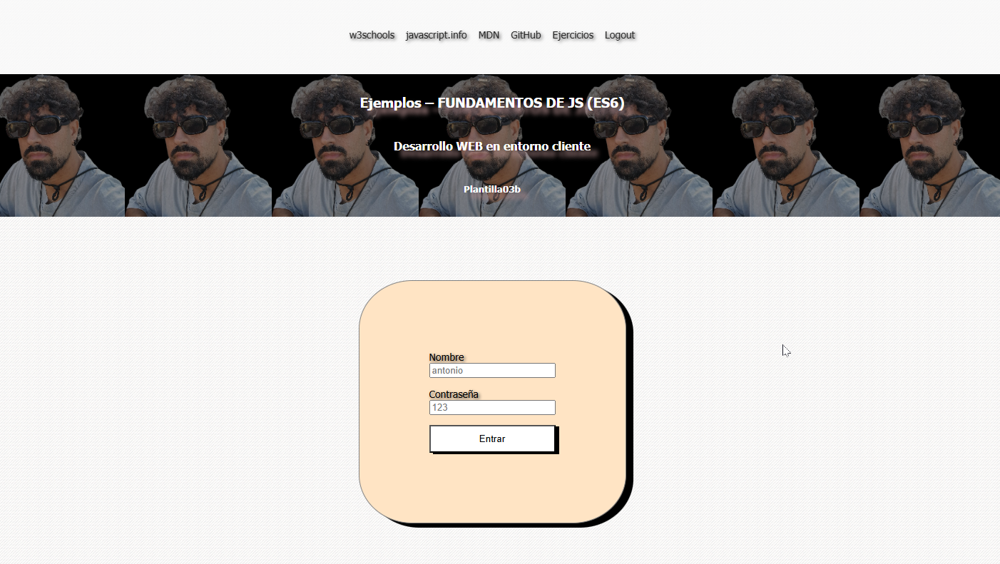
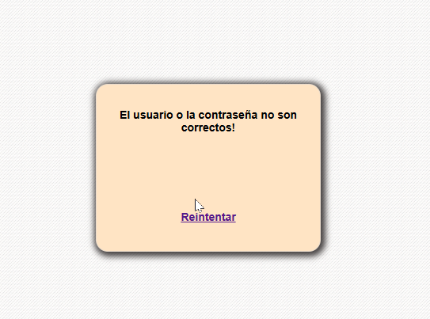
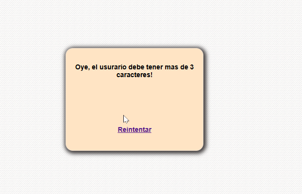
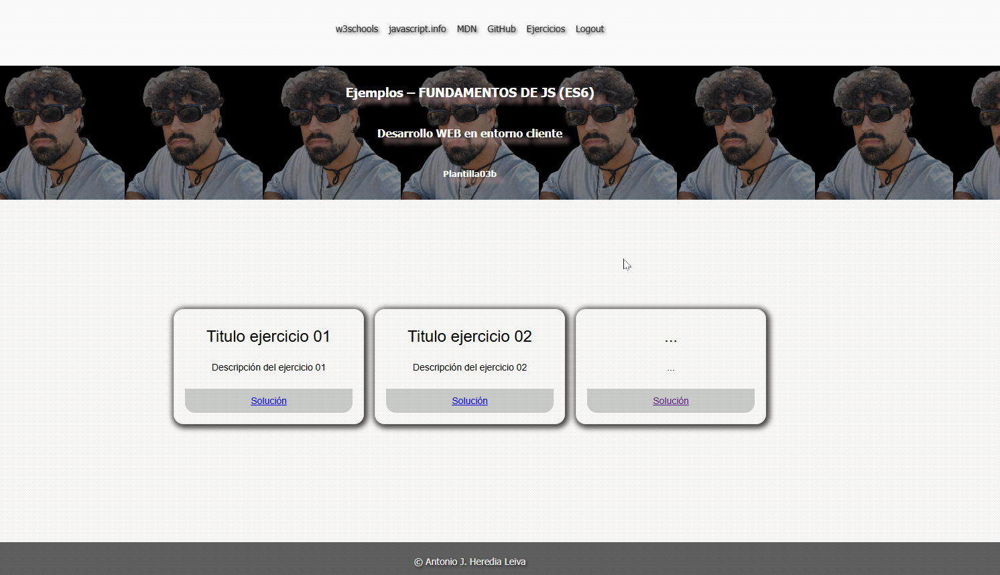

# Ejemplos – FUNDAMENTOS DE JS (ES6)

Este proyecto contiene ejemplos de fundamentos de JavaScript (ES6) para el desarrollo web en entorno cliente.

## Descripción

Este proyecto incluye una funcionalidad de logeo mediante promts y distintos mensajes dependiento de la entrada de estos. Debería darnos acceso a la página en el momento en que se ponga correctamente las credenciales.

## Instalación

Para utilizar este proyecto, simplemente clona el repositorio y abre los archivos HTML en tu navegador.

## Index

Pagina principal del proyecto, donde comprobamos el nombre y usuario, si no introduces nada, deberá lanzar los mensajes oportunos.

## Funcionamiento

Se abre la página, pon las credenciales antonio y 123, en el caso de dejar vacía cualquiera de los promts, nos lanzará el mensaje de validación de campo vacío, si las pones bien, debería lanzar el mensaje de welcome y mostrar el contenido de la página.
En el case contrario debe lanzar un alert con mensaje de error y preguntarte a través de un confirm si deseas volver a intentarlo.


<h2> Flujo de funcionamiento con imagenes </h2>

1. Primer acceso a la pagina



2. Dejando un campo vacío:


3. Error en las credenciales:


4. En caso de poner un nombre inferior a 3 carácteres:


5. Una vez consigamos acceder con nuestras credenciales:


<h2> Script </h2>

Tengo 2 funciones principales.

<h3> login() </h3>
Función que recoge valores del DOM y las lanza a través de otra función.
He querido añadir la función validar porque más adelante quiero ampliar el código poco a poco y modularizarlo es la forma mas cómoda para manejar posibles errores que puedan surgir en un futuro.

<h3> validar() </h3>
Está función es la que hace la gestión de errores, en un futuro va a tener un return con valores o con un booleano.

## Credenciales

```bash
# Usuario
antonio
# Contrasña
123
```
## Enlace al respositorio

```bash
# Clona el repositorio
git clone https://github.com/toniipower/JavascriptES6

# Entra en el directorio del proyecto
cd loginVentanas

