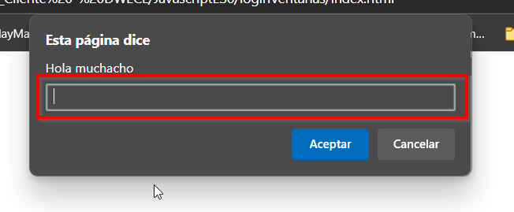
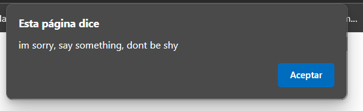
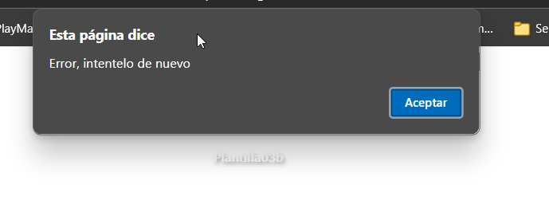
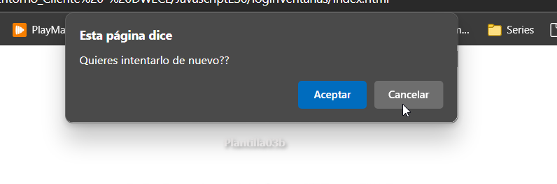
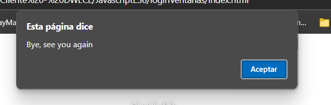
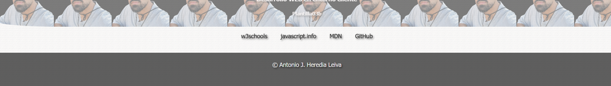
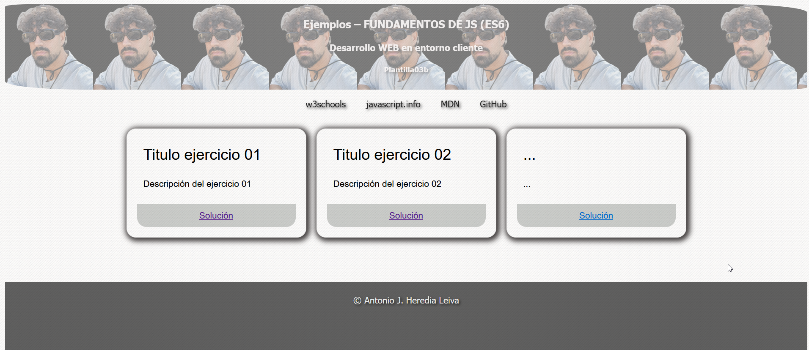

# Ejemplos – FUNDAMENTOS DE JS (ES6)

Este proyecto contiene ejemplos de fundamentos de JavaScript (ES6) para el desarrollo web en entorno cliente.

## Descripción

Este proyecto incluye una funcionalidad de logeo mediante promts y distintos mensajes dependiento de la entrada de estos. Debería darnos acceso a la página en el momento en que se ponga correctamente las credenciales.

## Instalación

Para utilizar este proyecto, simplemente clona el repositorio y abre los archivos HTML en tu navegador.

## Index

Pagina principal del proyecto, donde comprobamos el nombre y usuario, si no introduces nada, deberá lanzar los mensajes oportunos.

## Funcionamiento

Se abre la página, pon las credenciales anto y 123, en el caso de dejar vacía cualquiera de los promts, nos lanzará el mensaje de validación de campo vacío, si las pones bien, debería lanzar el mensaje de welcome y mostrar el contenido de la página.
En el case contrario debe lanzar un alert con mensaje de error y preguntarte a través de un confirm si deseas volver a intentarlo.

<h2> Flujo de funcionamiento con imagenes </h2>
<h3> Primer acceso a la página: </h3>


<h3> Dejando un campo vacío: </h3>



<h3> Error en las credenciales: </h3>


<h3> Pregunta si deseas volver a intentarlo: </h3>




<h3> En caso de que tengamos un error o demos cancelar en volver a intentar: </h3>


<h3> Una vez consigamos acceder con nuestras credenciales: </h3>



## Credenciales

```bash
# Usuario
anto
# Contrasña
123

```


```bash
# Clona el repositorio
git clone https://github.com/toniipower/JavascriptES6/tree/main/loginVentanas

# Entra en el directorio del proyecto
cd loginVentanas

