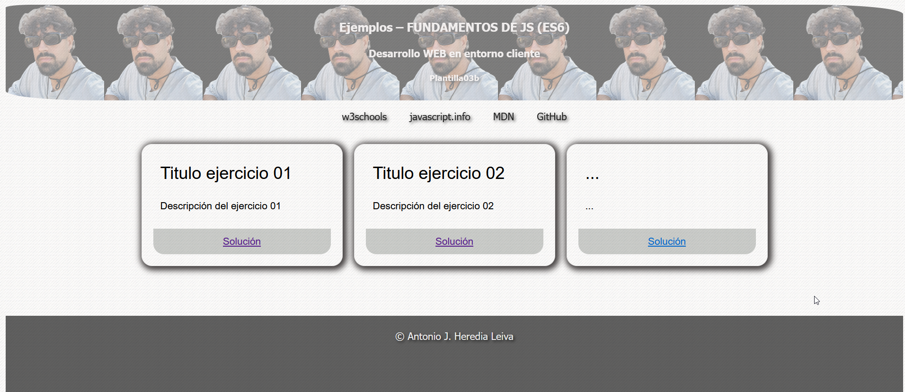

# Ejemplos – FUNDAMENTOS DE JS (ES6)

Este proyecto contiene ejemplos de fundamentos de JavaScript (ES6) para el desarrollo web en entorno cliente.

## Descripción

Este proyecto incluye varios ejercicios que demuestran conceptos fundamentales de JavaScript (ES6). Cada ejercicio está documentado y tiene una solución accesible a través de enlaces.

## Instalación

Para utilizar este proyecto, simplemente clona el repositorio y abre los archivos HTML en tu navegador.

## Index

Pagina principal del proyecto, donde accedemos a los distintos enlaces a los ejercicios.



```bash
# Clona el repositorio
git clone https://github.com/toniipower/JavascriptES6/tree/main/plantilla03

# Entra en el directorio del proyecto
cd plantilla03

